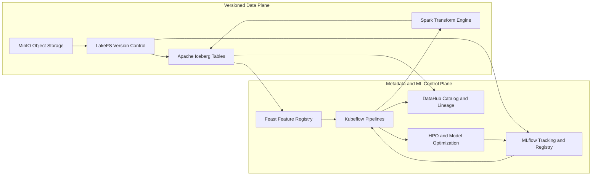
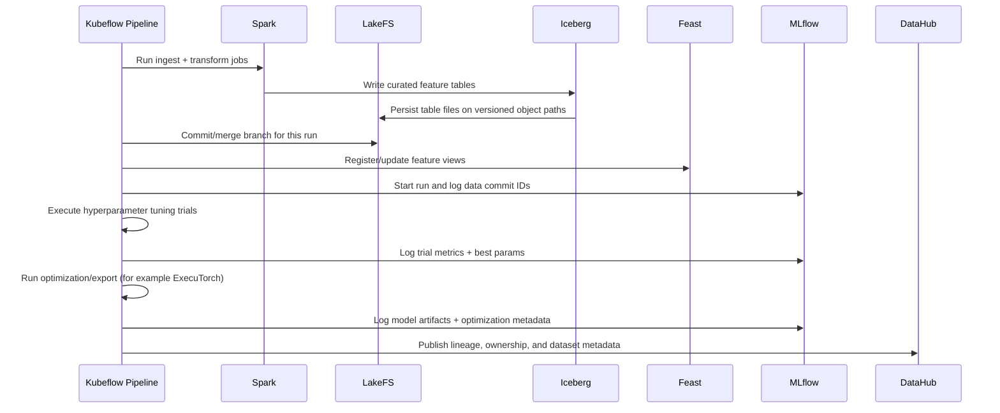

# Architecture

DFP separates the platform into two planes:
- **Versioned data plane**: MinIO + LakeFS + Iceberg (+ Spark for transformations)
- **Metadata/ML control plane**: Feast + MLflow + DataHub (+ Kubeflow for orchestration)

This split is what makes experiments reproducible and operationally scalable.

## Why these tools exist

| Tool | What it does | Why it is needed |
| --- | --- | --- |
| MinIO (object storage) | Stores raw files, table data files, model artifacts, and exports in S3-compatible buckets. | Provides durable, low-cost, scalable storage foundation for all data and artifacts. |
| LakeFS | Adds Git-like branching, commit, merge, and rollback semantics over object storage paths. | Lets teams version entire datasets and recover exact training states. |
| Apache Iceberg | Table format with ACID transactions, schema evolution, partition evolution, and snapshot metadata. | Makes large analytical tables reliable and queryable over object storage without mutable warehouse locks. |
| Spark | Distributed transform engine for ingestion, joins, aggregations, and feature generation on large data. | Executes heavy data engineering workloads efficiently and writes Iceberg tables at scale. |
| Feast | Feature store metadata/control layer for entities, feature views, and offline/online retrieval contracts. | Standardizes how training and serving read identical feature definitions. |
| MLflow | Tracks runs, params, metrics, artifacts, and model versions. | Provides experiment traceability and reproducibility for model development. |
| DataHub | Enterprise metadata catalog for datasets, schemas, lineage, ownership, and governance. | Makes data discoverable, auditable, and governable across tools and teams. |
| Kubeflow Pipelines | DAG orchestration for repeatable ML workflows on Kubernetes. | Coordinates multi-step pipelines, retries, caching, and dependency-aware execution. |
| HPO + model optimization steps | Automated search and post-training optimization (quantization/export/pruning where applicable). | Improves model quality-cost tradeoff and makes models deployable to runtime targets (for example ExecuTorch). |

## Why DataHub with object-backed storage

DataHub is not a replacement for MinIO/LakeFS/Iceberg; it is the metadata layer above them.

- Object storage (MinIO/S3-compatible) stores the physical files.
- LakeFS versions those files as commits/branches.
- Iceberg organizes them as transactional tables.
- DataHub indexes the resulting datasets, schemas, lineage, ownership, and tags.

This gives a clean separation:
- **Storage systems** handle bytes and table state.
- **Metadata systems** handle discoverability, lineage, trust, and governance.

Without DataHub, teams can still run pipelines, but cross-team visibility and governance degrade quickly.

## System integration view

## End-to-end pipeline flow

## Practical contract for reproducibility

For each training run, log at least:
- LakeFS repo, branch, commit ID
- Iceberg table(s) and snapshot ID(s)
- Feast feature service/view version
- Hyperparameters and search space
- Best-trial metrics and selected checkpoint
- Optimization/export settings and output artifact URIs

This is the minimum contract that allows a run to be replayed and audited later.

## Why Kubeflow orchestrates HPO and optimization

Hyperparameter tuning and optimization are not isolated scripts; they depend on data versions, feature definitions, and prior training outputs. Kubeflow makes this dependency graph explicit:
- Retries failed steps without rerunning everything.
- Parallelizes trials while preserving lineage.
- Captures step inputs/outputs for auditability.
- Promotes repeatable production-grade workflows instead of ad-hoc notebooks.
